# Hanko Plugin for Keycloak

This is an extension to Keycloak which integrates passwordless authentication via Hanko.

For more information about Keycloak, please visit the [Keycloak homepage](https://www.keycloak.org/).

For more information about Hanko, please visit the [Hanko homepage](https://hanko.io/).

You can try passwordless authentication with Hanko at our [Hanko Playground](https://playground.hanko.io/).

## Features

- Login with either password, Hanko Authenticator (FIDO UAF) or WebAuthn (FIDO U2F & FIDO2).
- Account-page to register and deregister a Hanko Authenticator or any FIDO U2F or FIDO2 authenticator via WebAuthn.
- REST endpoints to allow registration and deregistration of a Hanko Authenticator or WebAuthn device.

## Architecture / Context

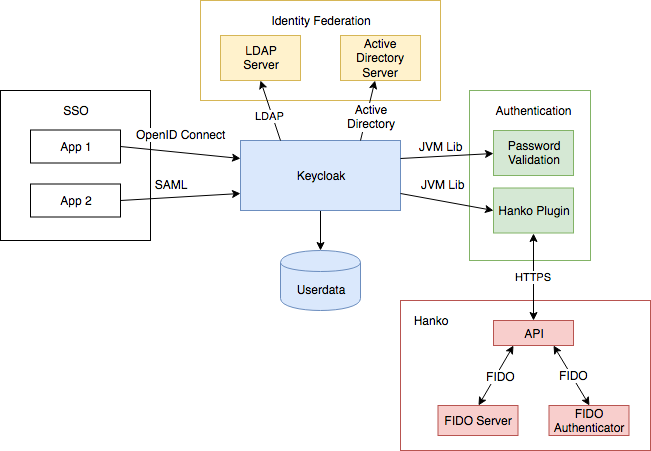

## Compatibility

The latest version of this plugin (v0.2) has been tested with Keycloak 4.8.3.Final and should be backwards compatible with Keycloak version >= 4.6.0.Final.

For Keycloak version 4.5.0.Final and earlier, you can use the plugin version v0.1.3.

You can compile the plugin for other releases by setting the Keycloak version in `hanko-plugin-keycloak-ejb/pom.xml` and in `pom.xml`. For more information regarding the compilation, please check chapter [Building](#building).

## Installation / Update

1. Download the latest version from the [releases page](https://github.com/teamhanko/hanko-keycloak-plugin/releases) and place the files at your keycloak root directory (for example /opt/jboss/keycloak).
2. Install the plugin by running
   ```bash
   ./bin/jboss-cli.sh --command="module add --name=hanko-plugin-keycloak-ejb --resources=./hanko-plugin-keycloak.jar --dependencies=org.keycloak.keycloak-common,org.keycloak.keycloak-core,org.keycloak.keycloak-services,org.keycloak.keycloak-model-jpa,org.keycloak.keycloak-server-spi,org.keycloak.keycloak-server-spi-private,javax.ws.rs.api,javax.persistence.api,org.hibernate,org.javassist,org.liquibase,com.fasterxml.jackson.core.jackson-core,com.fasterxml.jackson.core.jackson-databind,com.fasterxml.jackson.core.jackson-annotations,org.jboss.resteasy.resteasy-jaxrs,org.jboss.logging,org.apache.httpcomponents,org.apache.commons.codec"
   ```
3. Unzip themes.zip (or templates.zip, depending on the version) by running `unzip -o themes.zip -d .`

## Configuration

1. Login to your Keycloak administration console.
2. Goto configuration section **Realm Settings**, open the Themes tab and select either `hanko` (dark) or `playground` (light) as your **login-theme** and your **account-theme**.
   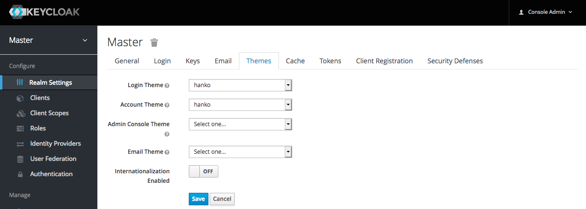
3. Goto configuration section **Authentication**.
4. Select the **Browser** authentication flow.
5. Click **copy** in the top right corner of the table.
   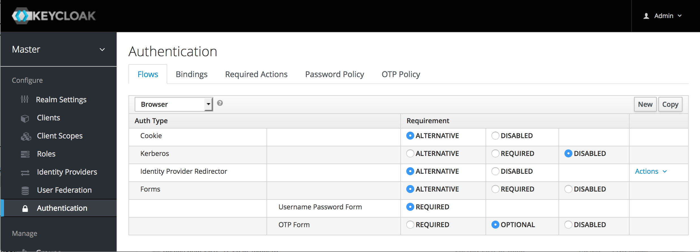
6. Give the new flow a meaningfull name, for example **Browser flow with Hanko**.
   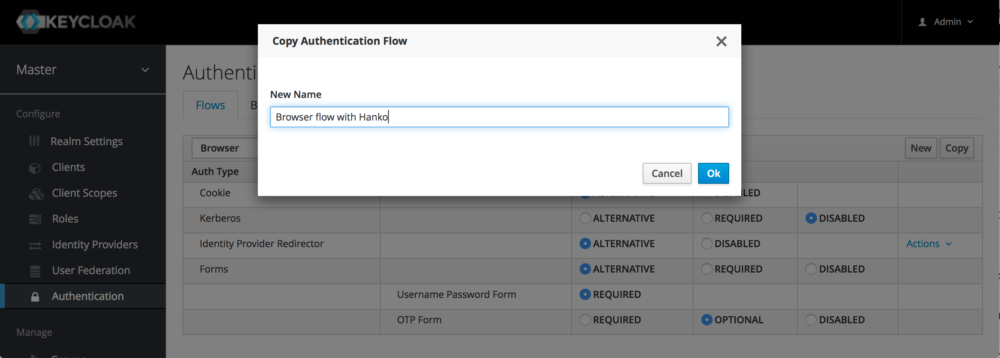
7. Delete the action **Username Password Form**.
8. Delete the action **OTP Form**.
   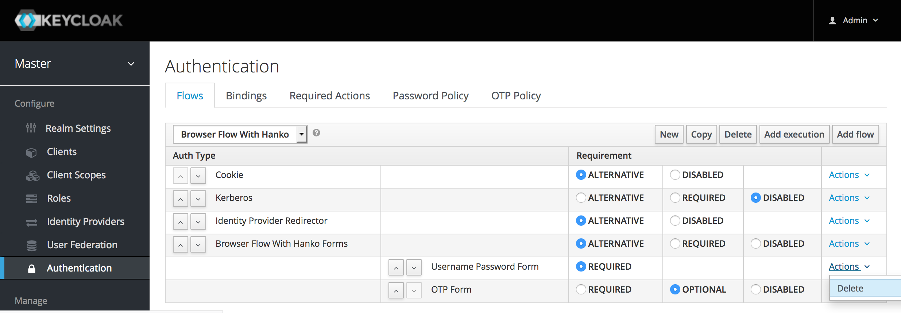
9. Add the execution **Hanko Username Authenticator** to the forms flow and mark it as **required**.
   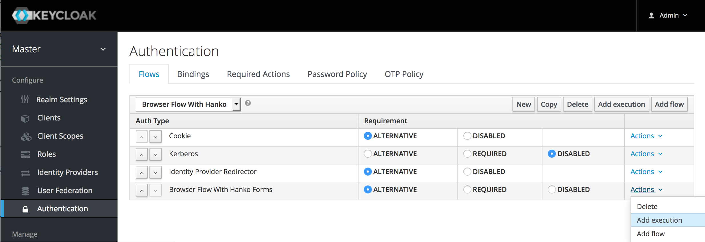
10. Add the execution **Hanko Multi Authenticator** and mark it as **required**.
11. Open the configuration of the **Hanko Multi Authenticator** flow by clicking **Actions** -> **Config** and insert your apikey ID and apikey secret.
    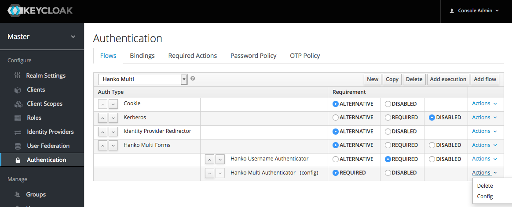
12. Open the **Bindings** tab and change the **Browser Flow** to **Browser flow with Hanko**.
    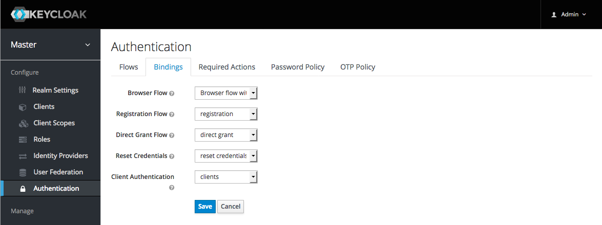

## Usage

You can register or deregister a Hanko Authenticator either by:

- using the provided account page
- providing your own account page, which calls the provided api endpoints

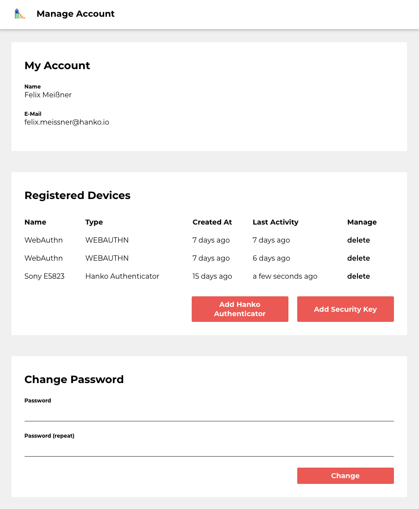

After successful registration of a Hanko Authenticator, you can leave the password-field empty and instead confirm your login with the Hanko Authenticator.
As a fallback, you can still login with your password.

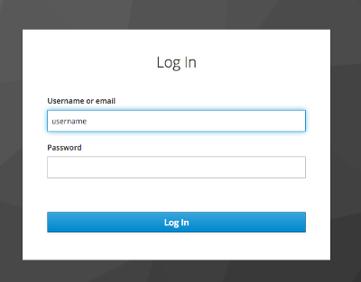


### Account page

Before you can use the provided account page, you have to add a **Client** to your realm
**(Note: If you use another realm than master, you have to replace master with your name in the URLs below)**:

1. Login to your Keycloak administration console.
2. Goto configuration section **Clients**.
3. Create a new client called **hanko-account** (in this step exact spelling matters) and leave the Root URL empty.
   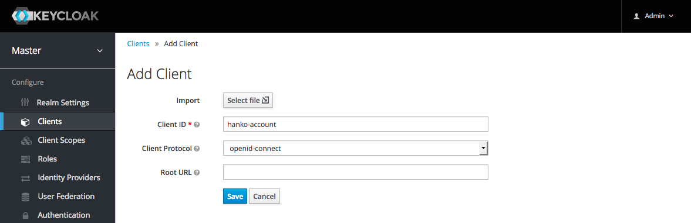
4. In the client configuration, set **Valid Redirect URIs** to **/auth/realms/master/hanko/\***.
5. In the client configuration, add **/auth/realms/master/hanko** as Web Origin.
   
6. Save the hanko-account client configuration.
7. Goto configuration section **Realm Settings**, open the Themes tab and select either `hanko` (dark) or `playground` (light) as your **account-theme**.
   

Now you can register and deregister a Hanko Authenticator by visiting the path `/auth/realms/master/hanko/status` at your Keycloak`s root-url.

You can provide a redirect url and a redirect name to the account page by using the url query parameters `redirect_url` and `redirect_name`:

```
/auth/realms/master/hanko/status?redirect_url=https://playground.hanko.io/&redirect_name=Go+back+to+Hanko+Playground
```

The redirect link will be displayed to the left of the logout button.

### API Endpoints

If you prefer to provide a custom account page, you can use the API provided by the plugin.

Before you can use the API endpoints, you need to configure a client according to your needs:

1. Login to your Keycloak administration console.
2. Goto configuration section **Clients**.
3. Create a new client and enter the origin of your web application as the root URL (when you use our examples, this would be `http://localhost:8888/`).
   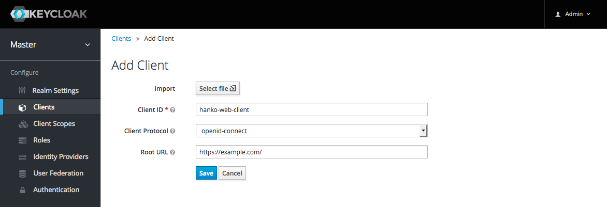
4. Save the new client.

#### Example code

We provide a plain html/javascript based example which demonstrates, how the API can be called at [example-api-javascript](example-api-javascript).

Before you can run the example, you need to do a little configuration work:

1. Adjust the url to your keycloak installation in **index.html** and in **keycloak.js**.
2. Also update the resource name in keycloak.js to the name of the client you have created in the previous step.
3. Your can run the example with a dockerized nginx: `docker run -it -p 8888:80 -v $(pwd)/example-api-javascript:/usr/share/nginx/html:ro nginx`

#### API Description

Given your realm is called `demo`, the following URLs can be used to configure passwordless authentication:

##### Get Status

- URL: /auth/realms/demo/hanko
- Method: GET

Response is either

```javascript
{ "isPasswordlessActive": false }
```

or

```javascript
{ "isPasswordlessActive": false }
```

.

##### Request Registration

- URL: /auth/realms/demo/hanko/register
- Method: POST

Response (example):

```javascript
{ qrCode: https://api.hanko.io/uaf/requests/1nIuGh4X4pavVtDrC1eUqIuTsUHJHYpRxasOhFmlSvEF/qrcode }
```

##### Await Registration Confirmation

- URL: /auth/realms/demo/hanko/register/complete
- Method: POST

```javasscript
{ "status": "OK" }
```

##### Deregistration

- URL: /auth/realms/demo/hanko/deregister
- Method: POST

Response:

```javascript
{ "isPasswordlessActive": false }
```

## Building

Ensure you have JDK 8 (or newer), Maven 3.1.1 (or newer) and Git installed:

```
java -version
mvn -version
git --version
```

Clone this repository:

```
git clone https://github.com/teamhanko/hanko-keycloak-plugin.git
cd hanko-keycloak-plugin
```

Build the plugin by running:

```
./build.sh
```

The themes archive as well as the plugin jar will be in `./dist`.

## Testing with Vagrant

You can use the vagrant to create a development or test environment with pre-installed keycloak 4.8.3.

You need the vagrant scp plugin:

```
vagrant plugin install vagrant-scp
```

```
git clone https://github.com/teamhanko/hanko-keycloak-plugin.git
cd hanko-keycloak-plugin
vagrant up
./deploy_vagrant.sh
vagrant ssh
cd /opt/keycloak-4.8.3.Final
./bin/add-user-keycloak.sh -r master -u admin -p admin
./bin/standalone.sh -b 0.0.0.0
```

You should now be able to login to the admin console at https://localhost:8443/ with username admin and password admin.

## License

This product is licensed under the [Apache License 2.0](http://www.apache.org/licenses/LICENSE-2.0).
